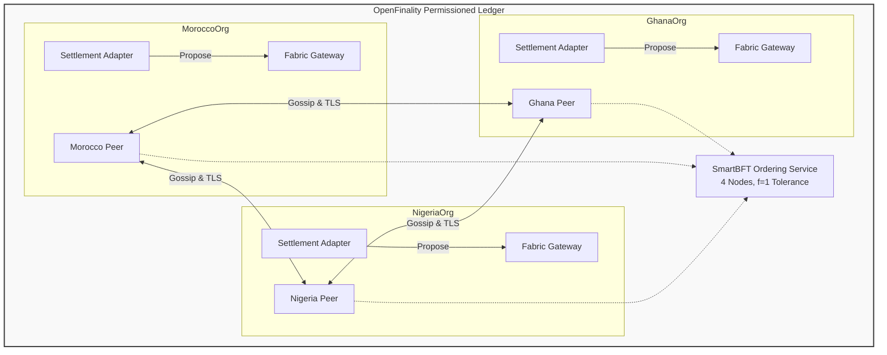

# OpenFinality 🌍🚆


**An open-source, permissioned, multi-institution settlement coordination network**

[](https://github.com/openfinality/openfinality/releases/tag/v0.1.0)
[](https://github.com/hyperledger/fabric)
[](https://github.com/hyperledger-labs/SmartBFT)
[](https://golang.org/)
[](LICENSE)

OpenFinality provides a unified standard for verifiable, cross-border multi-currency settlement execution between financial institutions across countries. It guarantees cryptographic non-repudiation, strict authorization policies, and robust fault tolerance without relying on a centralized intermediary for state coordination.

## 🧐 What OpenFinality IS and IS NOT

**OpenFinality IS:**
- **A Settlement Coordination Engine:** OpenFinality orchestrates the agreement and commitment of settlements.
- **A Multi-Institution Distributed Ledger:** A federated peer-to-peer network where participating institutions maintain sovereign copies of the shared truth.
- **Permissioned & Private:** Only vetted entities can join the network, ensuring compliance with banking regulations.
- **Resilient:** Tolerates malicious or offline institutions through Byzantine Fault Tolerance (SmartBFT).

**OpenFinality IS NOT:**
- **A Cryptocurrency or Token:** OpenFinality does *not* mint or manage digital assets. It coordinates settlement instructions over real-world fiat.
- **A Core Banking System:** It does not hold user balances. It coordinates the movement of liquidity between institutional omnibus accounts.
- **An FX Trading Venue:** It does not do price discovery or matchmaking. It simply provides the rails for settlement once an agreement is reached.

---

## 🏗 Architecture

OpenFinality operates on a sophisticated Hyperledger Fabric architecture combining SmartBFT consensus and State-Based Endorsement.



### Key Technical Innovations
1. **Affected-Party Endorsement:** Instead of requiring arbitrary global consensus, settlement state changes strictly require the endorsement of *only* the specific Counterparty and Initiator involved, powered by Fabric State-Based Endorsement.
2. **Domain-Level Authorization:** Specific administrative and operational roles (e.g., `role=settlement-adapter`) are cryptographically verified before allowing state execution.
3. **SmartBFT Resilience:** The network can suffer simultaneous arbitrary node failures and malicious activity without halting, ensuring financial continuity.

---

## 🚀 5-Minute Demo

Experience the full OpenFinality lifecycle on your local machine, simulating 3 central banks settling cross-border liquidity.

### Prerequisites
- Docker & Docker Compose (`colima` recommended for macOS)
- Go 1.22+
- Make

### Quickstart

1. **Bootstrap the Network**
   Start the Certificate Authorities, generate crypto materials, deploy the 4-node SmartBFT ordering service, and boot the Peers.
   ```bash
   make clean
   make bootstrap
   make up
   make deploy-chaincode
   ```

2. **Run the Interactive Simulator**
   Run the full end-to-end settlement demo. This will simulate a complete cross-border transaction flow between Nigeria, Ghana, and Morocco.
   ```bash
   make demo
   ```

3. **Verify Resilience (BFT Failure Demo)**
   Simulate a catastrophic outage by killing a BFT orderer node, and verify that the network continues to settle transactions seamlessly.
   ```bash
   make demo-bft-failure
   ```

4. **Teardown**
   ```bash
   make down
   ```

---

## 🎉 v0.1.0 Developer Preview Release Notes

We are thrilled to announce the **v0.1.0 Developer Preview**! 
This release transforms OpenFinality from a conceptual architecture into a provable, working backend.

**Highlights in this release:**
- **Fabric Upgrade:** Upgraded from `3.0.0-beta` to stable **Hyperledger Fabric v3.1.5**.
- **SmartBFT Integration:** Fully functional 4-node SmartBFT quorum.
- **Affected-Party Endorsement:** Generic `MAJORITY` endorsement replaced with dynamic State-Based Endorsement requiring only involved counterparties.
- **Strict Authorization:** Implementation of Certificate Attribute-Based Access Control (`role=settlement-adapter`).
- **Gateway SDK:** Replaced the legacy CLI shell-outs with a high-performance Go REST API powered by the Fabric Gateway SDK.
- **Robustness:** Verified network state persistence across restarts and extensive idempotency protections.

For the full roadmap, please see [ROADMAP.md](ROADMAP.md).

---

## 🤝 Contributing

We welcome contributions from the global financial technology and distributed ledger communities!
To get started:
1. Read our [CONTRIBUTING.md](CONTRIBUTING.md) guide.
2. Review the [ARCHITECTURE.md](ARCHITECTURE.md) to understand the core design principles.
3. Join the discussions in our issues tab.

Let's build the future of African financial infrastructure together. 🌍
